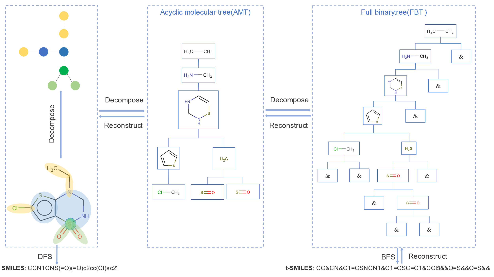

t-SMILES: A Scalable Fragment-based Molecular Representation Algorithm for De Novo Molecule Generation
======================================================================================================

This study introduces a scalable, fragment-based, multiscale molecular
representation algorithm called t-SMILES (tree-based SMILES). It describes
molecules using SMILES-type strings obtained by performing a breadth-first
search on a full binary tree formed from a fragmented molecular graph.

Systematic evaluations show that:

1) It can build a multilingual system for molecular description, in which each
decomposition algorithm creates a kind of language, and all these languages can
complement each other and contribute to a whole mixed chemical space. Under this
framework, classical SMILES can be unified as a special case of t-SMILES to
achieve better balanced performance using hybrid decomposition algorithms.

2) It significantly improves generalization performance compared with classical
SMILES, DeepSMILES, and SELFIES;

3) It performs excellently on low-resource datasets JNK3 and AID1706 whether it
is the original model or based on data augmentation or pre-training fine-tuning;

4) It outperforms previous fragment-based models being competitive with
classical SMILES and graph-based methods on Zinc, QM9, and ChEMBL.

5) It being universally adaptable to any decomposition method such as BRICS,
JTVAE, MMPA, or Scaffold.

6) It enables the robust application of sequence-based generative models, such
as LSTM, Transformer, VAE and AAE, in molecular modeling.

| Models[MolGPT]                   | Valid(↑) | Uniq(↑) | Novel(↑) | KLD(↑) | FCD(↑) | Active Novel(↑) |
|----------------------------------|----------|---------|----------|--------|--------|-----------------|
| SMILES [Rnd200]                  | 0.795    | 0.517   | 0.120    | 0.971  | 0.584  | 0.072           |
| DeepSMILES[Rnd200]               | 0.677    | 0.462   | 0.076    | 0.966  | 0.510  | 0.043           |
| SELFIES[Rnd200]                  | 1.000    | 0.689   | 0.238    | 0.944  | 0.544  | 0.148           |
| t-SMILES\_JTVAE[Rnd1000]         | 1.000    | 0.795   | 0.779    | 0.919  | 0.309  | 0.266           |
| t-SMILES\_BRICS[Rnd1000]         | 1.000    | 0.716   | 0.428    | 0.955  | 0.435  | 0.149           |
| t-SMILES\_MMPA[Rnd1000]          | 1.000    | 0.790   | 0.771    | 0.966  | 0.533  | 0.278           |
| t-SMILES\_Scaffold[Rnd1000]      | 1.000    | 0.924   | 0.821    | 0.940  | 0.587  | 0.563           |
| t-SMILES\_HSS[rnd200]            | 1.000    | 0.827   | 0.483    | 0.961  | 0.680  | 0.350           |
| t-SMILES\_H6[rnd200]\_R[JTVAE]   | 1.000    | 0.896   | 0.683    | 0.947  | 0.622  | 0.374           |
| SMILES\_Aug50[rnd10]             | 0.807    | 0.727   | 0.570    | 0.962  | 0.566  | 0.483           |
| t-SMILES\_Scaffold\_Rec50[rnd50] | 1.000    | 0.977   | 0.954    | 0.889  | 0.401  | 0.817           |
| TF\_SMILES[rnd10]                | 0.962    | 0.742   | 0.404    | 0.980  | 0.683  | 0.295           |
| TF\_t-SMILES\_Scaffold[rnd10]    | 1.000    | 0.927   | 0.865    | 0.931  | 0.541  | 0.658           |

Here we provide the source code of our method.

Dependencies
============

We recommend Anaconda to manage the version of Python and installed packages.

Please make sure the following packages are installed:

1.  Python**(version \>= 3.7)**

2.  [PyTorch](https://pytorch.org/)** (version == 1.7)**

>   \$ conda install pytorch torchvision cudatoolkit=x.x -c pytorch

>   Note: it depends on the GPU device and CUDA tookit

>   (x.x is the version of CUDA)

1.  [RDKit](https://www.rdkit.org/)** (version \>= 2020.03)**

>   \$ conda install -c rdkit rdkit

1.  Networkx**(version \>= 2.4)**

>   \$ pip install networkx

1.  [Numpy](https://numpy.org/)** (version \>= 1.19)**

>   \$ conda install numpy

1.  [Pandas](https://pandas.pydata.org/)** (version \>= 1.2.2)**

>   \$ conda install pandas

1.  [Matplotlib](https://matplotlib.org/)** (version \>= 2.0)**

>   \$ conda install matplotlib

Usage
=====

For designing the novel drug molecules with t-SMILES, you should do the
following steps sequentially by running scripts:

1.  DataSet/Graph/CNJTMol.py

>   preprocess()

>   It contained a preprocess function to generate t-SMILES from data set.

1.  DataSet/Tokenlizer.py

>   preprocess(delimiter=',', invalid\_token = '&', save\_split = False)

>   It defines a tokenizer tool which could be used to generate vocabulary of
>   t-SMILES and SMILES.

1.  DataSet/Graph/CNJMolAssembler.py

>   rebuild\_file()

>   It reconstructs molecules form t-SMILES to generate classical SMILES.

In this study, MolGPT, RNN, VAE, and AAE generative models are used for
evaluation.

Acknowledgement
===============

We thank the following Git repositories that gave me a lot of inspirations:

1.  GPT2: <https://github.com/samwisegamjeee/pytorch-transformers>

2.  MolGPT: https://github.com/devalab/molgpt

3.  MGM：https://github.com/nyu-dl/dl4chem-mgm

4.  JTVAE：[https](https://github.com/wengong-jin/icml18-jtnn)://github.com/wengon-jin/icml18-jtnn

5.  hgraph2graph: https://github.com/wengong-jin/hgraph2graph

6.  FragDGM: https://github.com/marcopodda/fragment-based-dgm

7.  Guacamol：<https://github.com/BenevolentAI/guacamol_baselines>

8.  MOSES: https://github.com/molecularsets/moses
