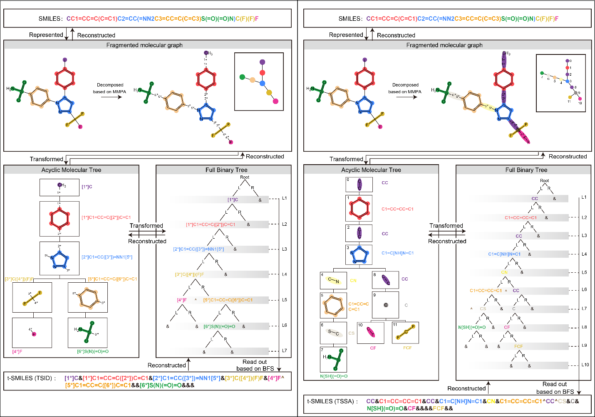
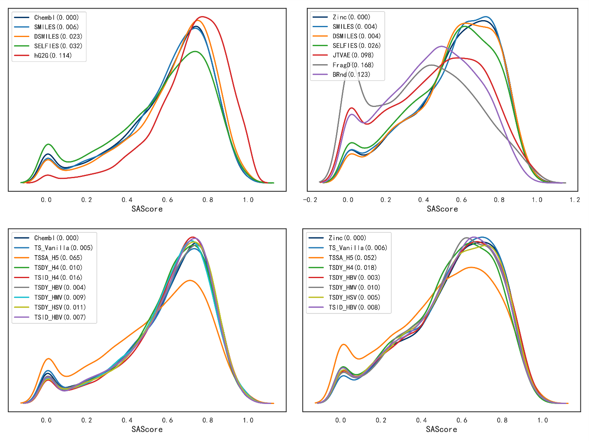
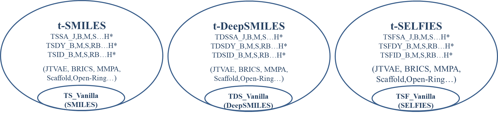

t-SMILES: A Scalable Fragment-based Molecular Representation Framework
======================================================================

When using advanced NLP methodologies to solve chemical problems, two
fundamental questions arise: 1) What are 'chemical words'? and 2) How can they
be encoded as 'chemical sentences’?

This study introduces a scalable, fragment-based, multiscale molecular
representation algorithm called t-SMILES (tree-based SMILES) to address the
second question. It describes molecules using SMILES-type strings obtained by
performing a breadth-first search on a full binary tree formed from a fragmented
molecular graph.

**For more details, please refer to the paper.**

>   TSSA, TSDY, TSID: <https://www.nature.com/articles/s41467-024-49388-6>

>   [TSIS](https://arxiv.org/abs/2402.02164): https://arxiv.org/abs/2402.02164

Systematic evaluations using JTVAE, BRICS, MMPA, and Scaffold show that:

1.  It can build a multi-code molecular description system, where various
    descriptions complement each other, enhancing the overall performance. Under
    this framework, classical SMILES can be unified as a special case of
    t-SMILES to achieve better balanced performance using hybrid decomposition
    algorithms.

2.  It exhibits impressive performance on low-resource datasets JNK3 and
    AID1706, whether the model is original, data augmented, or pre-training
    fine-tuned;

3.  It significantly outperforms classical SMILES, DeepSMILES, SELFIES and
    baseline models in goal-directed tasks.

4.  It outperforms previous fragment-based models being competitive with
    classical SMILES and graph-based methods on Zinc, QM9, and ChEMBL.

To support the t-SMILES algorithm, we introduce a new character, '&', to act as
a tree node when the node is not a real fragment in FBT. Additionally, we
introduce another new character, '\^', to separate two adjacent substructure
segments in t-SMILES string, similar to the blank space in English sentences
that separates two words.

Four coding algorithms are presented in these studies:

1.  TSSA: t-SMILES with shared atom.

2.  TSDY: t-SMILES with dummy atom but without ID.

3.  TSID: t-SMILES with ID and dummy atom.

4.  TSIS: Simplified TSID, including TSIS, TSISD, TSISO, TSISR.

For example, the three t-SMILES codes of Celecoxib are:

**TSID\_M:**

-   [1\*]C&[1\*]C1=CC=C([2\*])C=C1&[2\*]C1=CC([3\*])=NN1[5\*]&[3\*]C([4\*])(F)F&[4\*]F\^[5\*]C1=CC=C([6\*])C=C1&&[6\*]S(N)(=O)=O&&&

**TSDY\_M (replace [n\*] with \*):**

-   \*C&\*C1=CC=C(\*)C=C1&\*C1=CC(\*)=NN1\*&\*C(\*)(F)F&\*F\^\*C1=CC=C(\*)C=C1&&\*S(N)(=O)=O&&&

**TSSA\_M:**

-   CC&C1=CC=CC=C1&CC&C1=C[NH]N=C1&CN&C1=CC=CC=C1\^CC\^CS&C&N[SH]=O&CF&&&&FCF&&

**TSIS\_M:**

-   [1\*]C\^[1\*]C1=CC=C([2\*])C=C1\^[2\*]C1=CC([3\*])=NN1[5\*]\^[3\*]C([4\*])(F)F\^[5\*]C1=CC=C([6\*])C=C1\^[4\*]F\^[6\*]S(N)(=O)=O

**TSISD\_M:**

-   [1\*]C\^[1\*]C1=CC=C([2\*])C=C1\^[2\*]C1=CC([3\*])=NN1[5\*]\^[3\*]C([4\*])(F)F\^[4\*]F\^[5\*]C1=CC=C([6\*])C=C1\^[6\*]S(N)(=O)=O

**TSISO\_M:**

-   [2\*]C1=CC([3\*])=NN1[5\*]\^[1\*]C1=CC=C([2\*])C=C1\^[5\*]C1=CC=C([6\*])C=C1\^[3\*]C([4\*])(F)F\^[6\*]S(N)(=O)=O\^[1\*]C\^[4\*]F

Here we provide the source code of our method.

Dependencies
============

We recommend Anaconda to manage the version of Python and installed packages.

Please make sure the following packages are installed:

1.  Python(version \>= 3.7)

2.  [PyTorch](https://pytorch.org/) (version == 1.7)

3.  [RDKit](https://www.rdkit.org/) (version \>= 2020.03)

4.  Networkx(version \>= 2.4)

5.  [Numpy](https://numpy.org/) (version \>= 1.19)

6.  [Pandas](https://pandas.pydata.org/) (version \>= 1.2.2)

7.  [Matplotlib](https://matplotlib.org/) (version \>= 2.0)

8.  Scipy(version \>= 1.4.1)

Usage
=====

1.  **DataSet/Graph/CNJTMol.py**

>   encode\_single ()

>   It contained a preprocess function to generate t-SMILES from data set.

1.  **DataSet/Graph/CNJMolAssembler.py**

>   decode\_single()

>   It reconstructs molecules form t-SMILES to generate classical SMILES.

In this study, GPT and RNN generative models are used for evaluation.

Acknowledgement
===============

We thank the following Git repositories that gave me a lot of inspirations:

1.  MolGPT : https://github.com/devalab/molgpt

2.  MGM: https://github.com/nyu-dl/dl4chem-mgm

3.  JTVAE: https://github.com/wengon-jin/icml18-jtnn

4.  hgraph2graph: https://github.com/wengong-jin/hgraph2graph

5.  DeepSmiles: https://github.com/baoilleach/deepsmiles

6.  SELFIES: https://github.com/aspuru-guzik-group/selfies

7.  FragDGM: https://github.com/marcopodda/fragment-based-dgm

8.  CReM: https://github.com/DrrDom/crem

9.  AttentiveFP: https://github.com/OpenDrugAI/AttentiveFP

10. Guacamol: https://github.com/BenevolentAI/guacamol\_baselines

11. MOSES: https://github.com/molecularsets/moses

12. GPT2: <https://github.com/samwisegamjeee/pytorch-transformers>

13. Datamol: https://github.com/datamol-io/datamol
