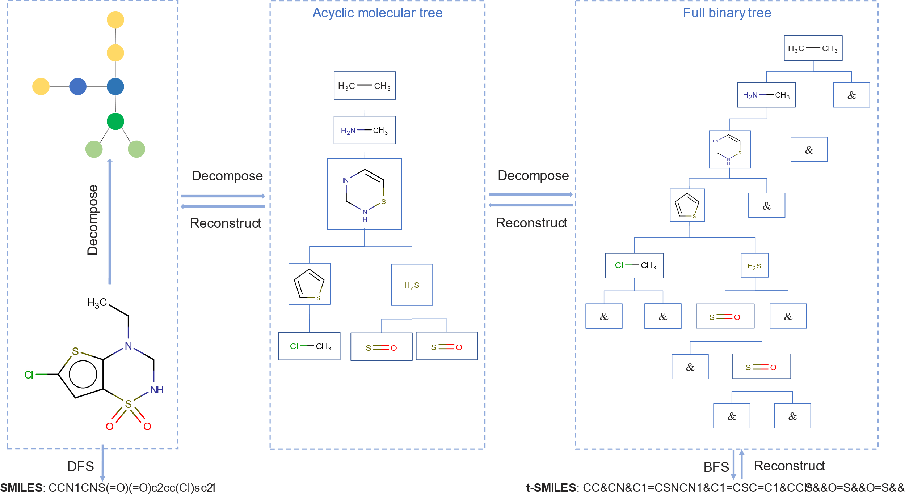
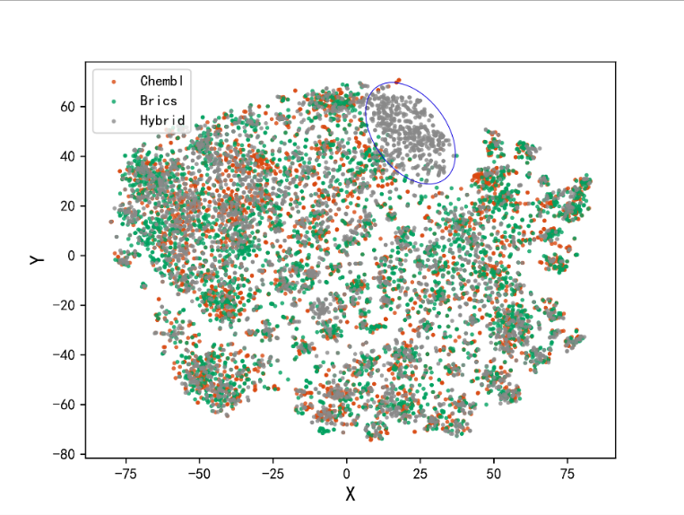

Fragment-based t-SMILES for de novo molecular generation
========================================================

The directory contains source code of the article: Wu et al's Fragment-based
t-SMILES for de novo molecular generation

In this study, we propose a general-purposed, fragment-based, hierarchical
molecular representation named t-SMILES (tree-based SMILES) which describes
molecules using a SMILES-type string obtained by doing breadth first search
(BFS) on full binary molecular tree formed from fragmented molecular graph.

t-SMILES uses SMILES instead of fragment dictionaries id to represent molecule
fragment, so that, powerful and rapidly developing sequence-based solutions can
be applied to fragment-based molecular tasks in the same way as classical
SMILES.

Compared with classical SMILES which is relatively difficult to be augmented, by
using different fragmentation algorithms, the training dataset is easier and
more efficiently to be expanded on t-SMILES to explore different chemical spaces
without having to change anything of the architecture of generation model.

Here we provide the source code of our method.

Dependencies
============

We recommend Anaconda to manage the version of Python and installed packages.

Please make sure the following packages are installed:

1.  Python**(version \>= 3.7)**

2.  [PyTorch](https://pytorch.org/)** (version == 1.7)**

\$ conda install pytorch torchvision cudatoolkit=x.x -c pytorch

Note: it depends on the GPU device and CUDA tookit

(x.x is the version of CUDA)

1.  [RDKit](https://www.rdkit.org/)** (version \>= 2020.03)**

\$ conda install -c rdkit rdkit

1.  Networkx**(version \>= 2.4)**

\$ pip install networkx

1.  [Numpy](https://numpy.org/)** (version \>= 1.19)**

\$ conda install numpy

1.  [Pandas](https://pandas.pydata.org/)** (version \>= 1.2.2)**

\$ conda install pandas

1.  [Matplotlib](https://matplotlib.org/)** (version \>= 2.0)**

\$ conda install matplotlib

Usage
=====

For designing the novel drug molecules with t-SMILES representation, you should
do the following steps sequentially by running scripts:

1.  Applications/GPT2/GPT2App.py

>   train\_single\_voc\_file()

>   generate\_seq()

1.  DataSet/Graph/CNJMolAssembler.py

>   rebuild\_file()

In addition, this toolkit also provides some other scripts for data processing
and model architectures etc.

1.  DataSet/JTNN/MolTree.py

>   It defines molecule fragmentation algorithms include BRICS and JTVAE, which
>   could be used to generate fragment vocabulary

1.  DataSet/Graph/CNJTMol.py

>   It contained a preprocess function to generate t-SMILES from data set.

1.  DataSet/Tokenlizer.py

>   It defines a tokenizer tool which could be used to generate vocabulary of
>   t-SMILES and SMILES.

1.  Models/Parameters.py

>   It defines the parameter for training.

Acknowledgement
===============

We thank the following Git repositories that gave me a lot of inspirations:

1.  GPT2: https://github.com/samwisegamjeee/pytorch-transformers

2.  JTVAE:
    [https](https://github.com/wengong-jin/icml18-jtnn)://github.com/wengon-jin/icml18-jtnn
